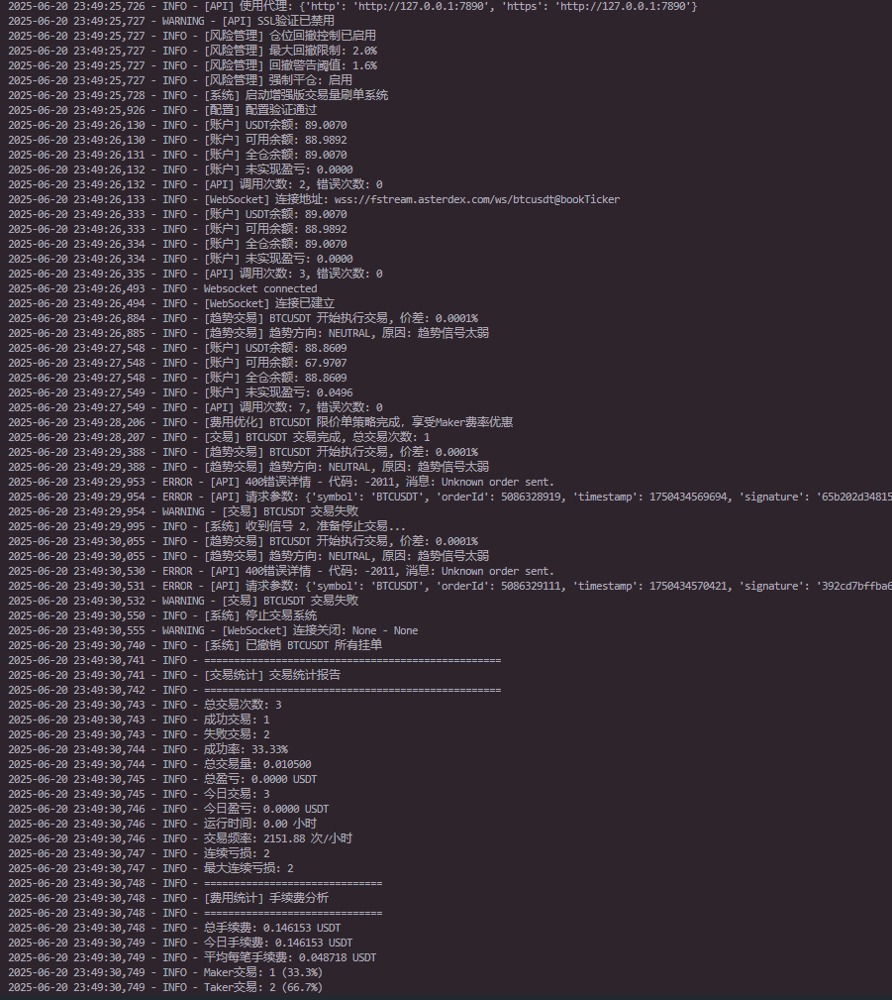

# AsterDex 增强交易系统 (精简版)

一个基于AsterDex API的自动化交易系统，支持趋势分析和智能交易策略。

## 🔴Linux/WSL/macOS 用户：

### 1. 克隆仓库/安装依赖（确保你已安装 `git`，如果未安装请参考➡️[安装git教程](./安装git教程.md)）

```bash
# 克隆仓库并进入项目目录
git clone https://github.com/oxmoei/AsterDexVolume.git && cd AsterDexVolume

# 自动安装缺失的依赖和配置环境
./install.sh
```
### 2. 配置API密钥

编辑 `config.py` 文件，填入你的AsterDex API密钥：

```python
API_CONFIG = {
    "API_KEY": "你的API密钥",
    "SECRET_KEY": "你的SECRET密钥",
    # ... 其他配置保持默认
}
```
### 3. 运行交易系统

```bash
poetry run python enhanced_volume_trader.py
```
---

## 🔴Windows 用户：

### 1. 克隆仓库/安装依赖（确保你已安装 `git`，如果未安装请参考➡️[安装git教程](./安装git教程.md)）

以管理员身份启动 PowerShell
```powershell
# 克隆仓库并进入项目目录
git clone https://github.com/oxmoei/AsterDexVolume.git
cd AsterDexVolume

# 设置允许当前用户运行脚本和启用 TLS 1.2
Set-ExecutionPolicy Bypass -Scope CurrentUser -Force; [System.Net.ServicePointManager]::SecurityProtocol = [System.Net.ServicePointManager]::SecurityProtocol -bor 3072;

# 自动安装缺失的依赖和配置环境
.\install_for_wins.ps1
```
### 2. 配置API密钥
- 注册并创建API：[注册 Aster 获取30%手续费优惠](https://www.asterdex.com/zh-CN/referral/5e0897)

- 编辑 `config.py` 文件，填入你的AsterDex API密钥：

```python
API_CONFIG = {
    "API_KEY": "你的API密钥",
    "SECRET_KEY": "你的SECRET密钥",
    # ... 其他配置保持默认
}
```
### 3. 运行交易系统

```bash
poetry run python enhanced_volume_trader.py
```
---

## ⚙️ 主要功能

- **智能价差监控**: 实时监控市场价差，发现交易机会
- **趋势分析**: 基于移动平均线、RSI等技术指标进行趋势判断
- **多种交易策略**: 
  - 趋势跟随策略 (做多/做空)
  - 传统双向刷单策略
  - 限价单优化 (降低手续费)
- **风险管理**: 
  - 仓位回撤控制
  - 止损止盈设置
  - 日交易限制
- **实时监控**: WebSocket实时价格数据推送

## 🔧 配置说明

### 交易参数 (config.py)

```python
TRADING_CONFIG = {
    "SYMBOLS": ["BTCUSDT"],           # 交易对
    "TRADE_QUANTITY": 0.0035,         # 交易数量
    "MIN_SPREAD_THRESHOLD": 0.001,    # 最小价差阈值
    "MAX_DAILY_LOSS": 100,            # 日最大亏损(USDT)
    "MAX_POSITION_DRAWDOWN": 0.02,    # 最大仓位回撤(2%)
}
```

### 代理设置

如果需要使用代理访问API：

```python
API_CONFIG = {
    "USE_PROXY": True,
    "PROXY_HTTP": "http://127.0.0.1:7890",
    "VERIFY_SSL": False,  # 代理环境下可能需要禁用SSL验证
}

WEBSOCKET_CONFIG = {
    "USE_PROXY": True,
    "PROXY_HOST": "127.0.0.1",
    "PROXY_PORT": 7890,
    "VERIFY_SSL": False,
}
```

## 📊 交易策略

### 1. 趋势跟随策略
- 基于短期/长期移动平均线判断趋势方向
- RSI指标过滤过买过卖区域
- 动态调整交易方向 (LONG/SHORT)

### 2. 限价单优化
- 优先使用限价单成为Maker，享受手续费返佣
- 动态调整价格偏移，提高成交率
- 目标Maker比例: 80%

### 3. 风险控制
- 实时监控仓位回撤，超限自动平仓
- 设置止损(2%)和止盈(5%)
- 连续亏损保护机制

## 📈 监控界面

系统运行时会显示：
- 实时交易统计
- 手续费分析报告
- 趋势分析结果
- 风险控制状态

```
[交易统计] 总交易次数: 156
[交易统计] 成功率: 89.74%
[费用统计] Maker交易: 125 (80.1%)
[趋势分析] 当前趋势: BULLISH, 强度: 0.234
```

## 🛡️ 安全提醒

1. **API密钥安全**: 
   - 不要将API密钥提交到版本控制系统
   - 建议使用只读或交易权限的API密钥
   - 定期更换API密钥

2. **风险控制**:
   - 建议先在测试环境运行
   - 设置合理的交易数量和风险限制
   - 定期检查账户状态

3. **网络安全**:
   - 使用可信的代理服务
   - 启用SSL验证(如网络环境允许)

## 🔍 故障排除

### SSL证书错误
```
[SSL: CERTIFICATE_VERIFY_FAILED]
```
**解决方案**: 在config.py中设置 `"VERIFY_SSL": False`

### WebSocket连接失败
```
WebSocket连接错误
```
**解决方案**: 
1. 检查代理设置是否正确
2. 确认代理软件正在运行
3. 尝试不同的代理类型 (http/socks5)

### API连接超时
```
API连接测试失败: timeout
```
**解决方案**:
1. 检查网络连接
2. 确认API密钥配置正确
3. 检查代理设置

## 📝 日志文件

系统会自动创建 `logs/` 目录并保存日志：
- `logs/trading.log` - 主要交易日志
- 日志文件会自动轮转，保留最近5个文件

## ⚠️ 免责声明

本软件仅供学习和研究使用。使用本软件进行实际交易的风险由用户自行承担。作者不对任何交易损失承担责任。

## 📞 技术支持

如遇到问题，请检查：
1. API密钥配置是否正确
2. 网络连接是否正常
3. 代理设置是否匹配你的网络环境
4. 查看日志文件获取详细错误信息

---

## 样例




**注意**: 请确保在开始实际交易前充分理解系统的工作原理和风险控制机制。 